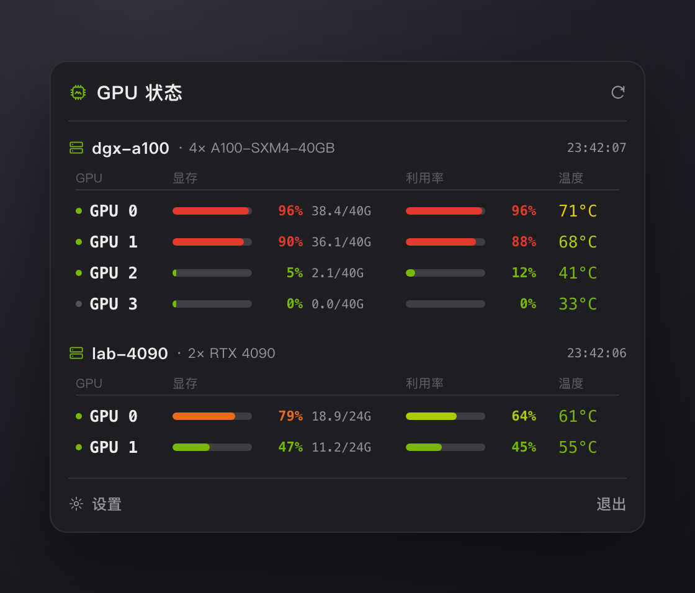
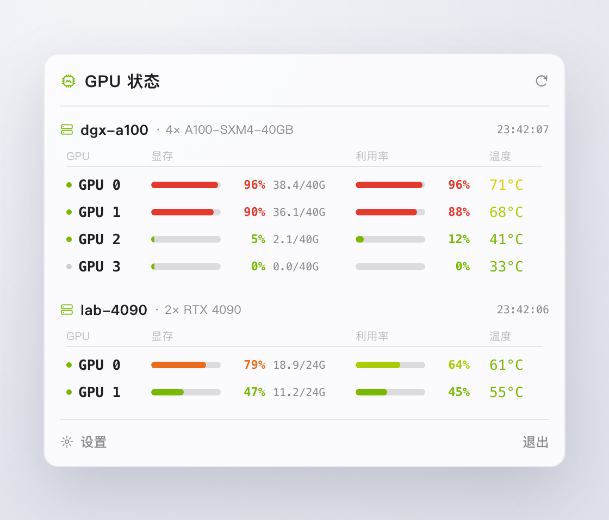
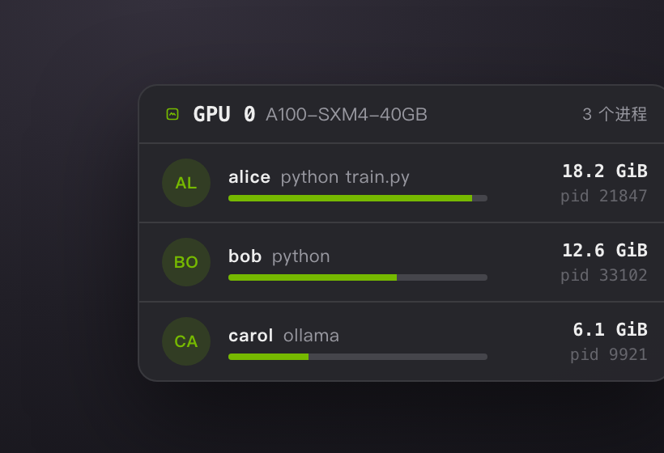

# Server GPU Status

<p align="center">
  
</p>

<p align="center">
  <strong>macOS 菜单栏 GPU 监控工具</strong>
</p>

<p align="center">
  Swift 原生开发，成品仅几 MB。通过 SSH 把多台远程服务器的 GPU 状态收进菜单栏：利用率、显存、温度、占用进程，一眼看全。
</p>

<p align="center">
  <a href="#截图">截图</a> ·
  <a href="#功能亮点">功能亮点</a> ·
  <a href="#安装">安装</a> ·
  <a href="#系统要求">系统要求</a> ·
  <a href="#构建">构建</a>
</p>

<p align="center">
  
  
  
</p>

## 截图

| 深色 | 浅色 |
| --- | --- |
|  |  |

悬停某块 GPU，弹出该卡上的计算进程、占用用户与显存：

<p align="center">
  
</p>

> 以上为演示示例，主机名 / 用户名 / 占用数据均为虚构。

## 功能亮点

### 多服务器并发监控

所有要看的服务器同时拉取，一个面板纵览全部。每块 GPU 一行，显示利用率、显存（已用 / 总量）和温度，配色随负载从绿过渡到黄、红，忙不忙一眼就能判断。

### 菜单栏实时摘要

菜单栏图标旁直接显示所有服务器中的最高 GPU 利用率，不用点开也知道整体水位。

### 进程与占用用户

鼠标悬停某块 GPU，弹出该卡上的计算进程，显示 PID、占用用户和显存占用——直接看到是谁在占卡。

### 自动读取 SSH 配置

自动扫描 `~/.ssh/config` 里能直连的 `Host` 别名并列出来，也可以在设置里手动添加自定义服务器（user / host / port / 密钥）。仓库与本地存储中**不含任何主机或账号信息**，全部运行时从你本机读取。

### 省心的刷新策略

面板打开时快速刷新（默认 1 秒）、关闭后降速省资源（默认 10 秒），间隔均可配。睡眠唤醒、断网恢复后自动立即刷新，不会让你盯着一屏陈旧或全红的数据。

## 安装

1. 从 [Releases](../../releases) 下载最新版 `.dmg`
2. 打开 DMG，将 **Server GPU Status** 拖入「应用程序」文件夹

## 未公证应用放行

本应用为个人自用工具，未经过 Apple 公证，首次打开会被 macOS 拦截。安装后在终端执行一次：

```bash
sudo xattr -cr "/Applications/Server GPU Status.app"
```

之后即可正常启动。

## 系统要求

- macOS 13 及以上
- 目标服务器上有 `nvidia-smi`
- 本机能**免密** SSH 登录目标服务器（密钥已加入 ssh-agent）。验证：

  ```bash
  ssh 你的主机别名 nvidia-smi   # 这条能直接成功，App 就能工作
  ```

  若私钥带 passphrase，先加载到 agent：`ssh-add --apple-use-keychain ~/.ssh/id_ed25519`

## 监控范围

- **利用率**：每块 GPU 的计算利用率
- **显存**：已用 / 总量，含百分比与 GiB 文本
- **温度**：每块 GPU 的温度
- **进程**：每块卡上的计算进程、PID、占用用户、显存占用
- **菜单栏摘要**：所有可见服务器中的最高利用率

## 构建

仅需 Command Line Tools，无需完整版 Xcode：

```bash
./build.sh                          # 编译并组装 "build/Server GPU Status.app"
open "build/Server GPU Status.app"
```

开发时用 `./dev.sh` 可一步完成「杀旧实例 → 重建 → 热替换菜单栏中的 App」。运行日志写在 `~/Library/Logs/GPUStatus.log`。

## 许可证

[MIT](LICENSE)
